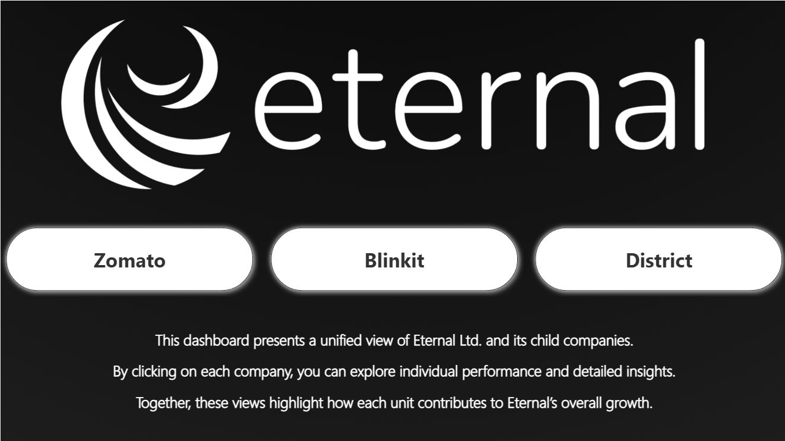
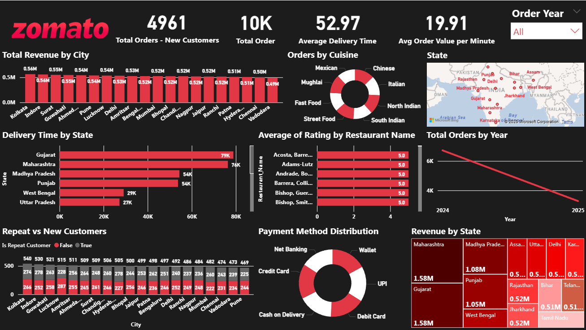
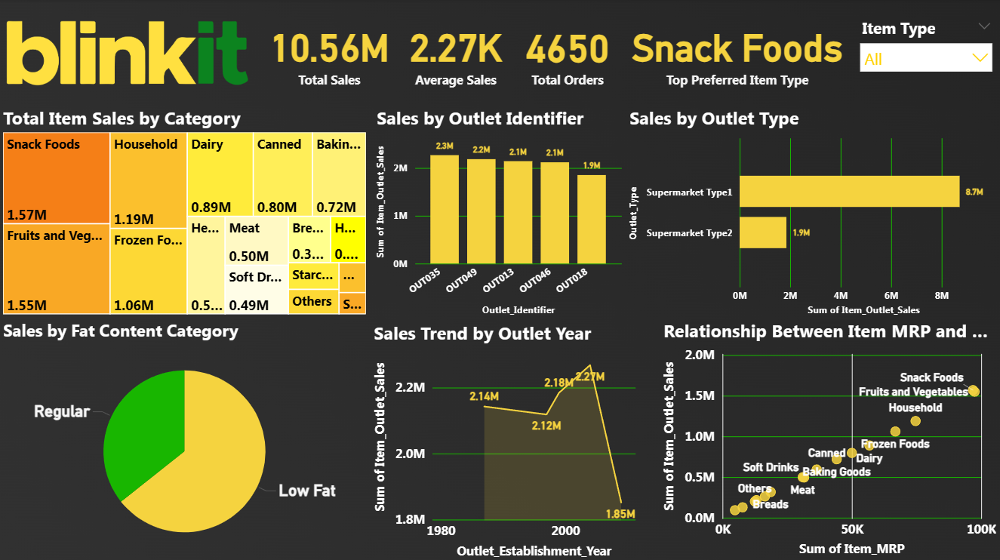
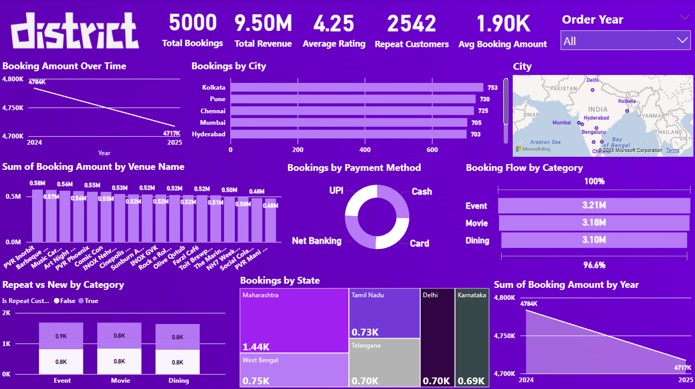

# 📊 Eternal Product Analytics Dashboard

## 📌 Project Overview

The **Eternal Product Analytics Dashboard** is an interactive Power BI project designed to analyze key business and consumer insights across multiple platforms in the Eternal ecosystem.

The dashboard provides a centralized view of performance metrics across:

- 🍽️ **Zomato** – Food Delivery & Restaurant Analytics
- 🛒 **Blinkit** – Quick Commerce & Grocery Analytics
- 🎟️ **District** – Entertainment, Events & Dining Analytics

The project focuses on transforming raw data into meaningful business insights through interactive dashboards and visual storytelling.

---

## 🎯 Business Objective

The objective of this project is to analyze business performance and consumer behavior across different platforms and answer questions such as:

- What are the key performance trends across different businesses?
- Which categories, products, or services contribute the most?
- How does customer behavior vary across platforms?
- Which locations or outlets demonstrate strong performance?
- What insights can support data-driven business decisions?

---

# 📊 Dashboard Pages

The Power BI report contains four interactive pages.

## 🏠 1. Eternal Dashboard – Main View

The main dashboard provides a centralized overview of key metrics across the platforms.

### Key Features:

- Overall business performance overview
- Platform-level insights
- KPI monitoring
- Interactive navigation between dashboards


---

## 🍽️ 2. Zomato Analytics

The Zomato dashboard analyzes food delivery and restaurant-related data.

### Key Analysis Areas:

- Restaurant ratings
- Customer preferences
- Food delivery patterns
- Restaurant performance
- Cuisine and category analysis
- Geographic insights


### Business Questions:

- Which restaurants receive the highest ratings?
- What cuisines are most preferred?
- How does restaurant performance vary across locations?
- What factors influence customer preferences?


---

## 🛒 3. Blinkit Analytics

The Blinkit dashboard focuses on quick-commerce and grocery analytics.

### Key Analysis Areas:

- Grocery product performance
- Outlet performance
- Sales trends
- Product categories
- Consumer purchasing behavior


### Business Questions:

- Which product categories generate the highest sales?
- Which outlets perform the best?
- How does outlet size and location impact performance?
- What consumer purchasing trends can be identified?

---

## 🎟️ 4. District Analytics

The District dashboard analyzes customer booking behavior across entertainment and lifestyle categories.

### Key Analysis Areas:

- Movie bookings
- Event bookings
- Dining categories
- Customer preferences
- Category performance
- Booking trends

### Business Questions:

- Which categories generate the highest engagement?
- What booking patterns can be observed?
- Which entertainment categories are most popular?
- How do customer preferences vary across categories?


---

# 🛠️ Tools & Technologies Used

| Tool | Purpose |
|------|---------|
| Power BI | Dashboard Development & Data Visualization |
| Power Query | Data Cleaning & Transformation |
| DAX | KPI and Measure Calculations |
| Microsoft Excel | Dataset Storage & Initial Data Exploration |

---

# 📂 Project Structure

```text
Eternal-Dashboard-Analytics/
│
├── 📁 Datasets/
│   ├── Blinkit Dataset.xlsx
│   ├── District Dataset.xlsx
│   └── Zomato Dataset.xlsx
│
│
├── 📁Elements/
│   ├── Eternal-View.png
│   ├── Blinkit-View.png
│   ├── Zomato-View.png
│   └── District-View.png
│
├── 📊Eternal_Combined.pbix
│
└── 📄README.md
